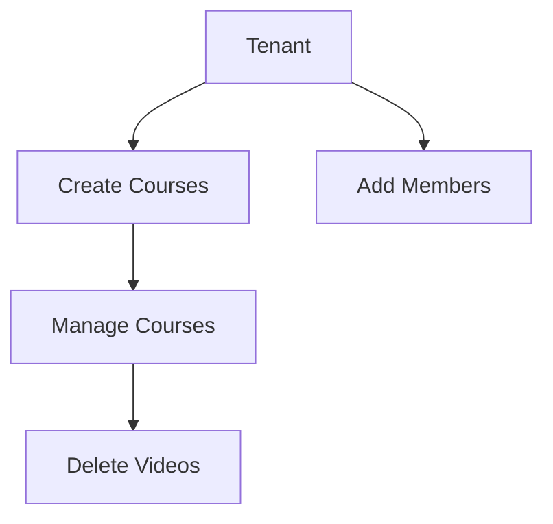

# Feature: Tenant and User Management for Courses

## Description
Implement a feature where a tenant and user can create courses under the tenant. This includes adding members to tenants, assigning them to courses, and allowing the course admin (tenant creator) to manage the course, including deleting videos.

### Features:
- Add and manage tenants
- Create and manage courses under tenants
- Add and manage members in tenants
- Permissions for course management

