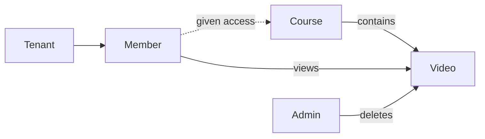

# Idea: Member Course Access

## Description
Once a member is added to a tenant and is given access to a course, that member can view videos inside the course. Only the admin (tenant creator) can delete videos.

### Actions
- Members gain access to course materials (videos) upon assignment.
- Deletion of videos is an admin-only (tenant creator) permission.

## Reference
- Meeting notes: Discussion between Deepak and Janaki.
- [Related Feature](Feature-Tenant-and-User-Management.md)

## Mermaid Diagram

